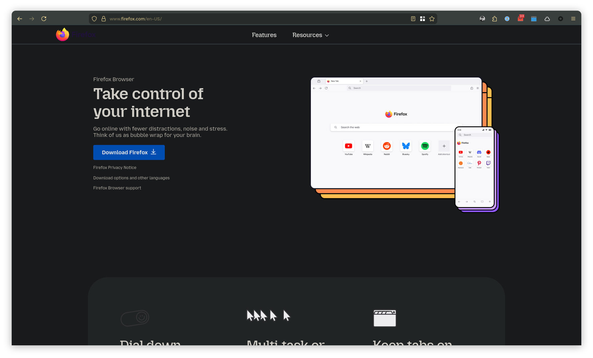

# Firefox Custom CSS - GNOME Style

Custom Firefox CSS theme featuring GNOME-style rounded corners and a clean, compact layout. Based on the approach from [varun.ch](https://varun.ch/posts/firefox/) with additional enhancements for better desktop integration.



## Features

### 🎨 Visual Design
- **GNOME-style rounded corners** (12px window radius)
- **Compact single-row layout** with hidden tab bar
- **Rounded UI elements** (8px URL bar, 6px buttons)
- **Clean navbar** with reduced padding and optimized height
- **Custom new tab styling** with improved color scheme

### 🔧 Layout Optimizations
- Hidden default tab bar for more screen space
- Compact toolbar with reduced vertical padding
- Rounded navigation buttons (back, forward, reload, etc.)
- Rounded extension buttons
- Optimized sidebar integration

### 🌙 Theme Integration
- Compatible with Firefox themes and Stylix theming
- Custom color scheme for new tab page
- Improved contrast and readability

## Installation

### Prerequisites
- Firefox with custom CSS support enabled
- `toolkit.legacyUserProfileCustomizations.stylesheets` set to `true` in `about:config`

### Manual Installation

1. **Locate your Firefox profile directory:**
   - Navigate to `about:profiles` in Firefox
   - Find your default profile and note the "Root Directory" path
   - Or typically located at:
     - Linux: `~/.mozilla/firefox/[profile-id].default`
     - macOS: `~/Library/Application Support/Firefox/Profiles/[profile-id].default`
     - Windows: `%APPDATA%\Mozilla\Firefox\Profiles\[profile-id].default`

2. **Create chrome directory:**
   ```bash
   mkdir -p [profile-directory]/chrome
   ```

3. **Copy CSS files:**
   ```bash
   # Download and copy userChrome.css
   curl -o [profile-directory]/chrome/userChrome.css https://raw.githubusercontent.com/bashfulrobot/firefox-custom-css/main/userChrome.css
   
   # Download and copy userContent.css
   curl -o [profile-directory]/chrome/userContent.css https://raw.githubusercontent.com/bashfulrobot/firefox-custom-css/main/userContent.css
   ```

4. **Enable custom CSS in Firefox:**
   - Type `about:config` in the address bar
   - Search for `toolkit.legacyUserProfileCustomizations.stylesheets`
   - Set the value to `true`

5. **Restart Firefox** to apply the changes

### NixOS Installation

If you're using NixOS with Home Manager, you can integrate this CSS automatically:

```nix
programs.firefox = {
  enable = true;
  profiles.default = {
    userChrome = builtins.readFile ./userChrome.css;
    userContent = builtins.readFile ./userContent.css;
    settings = {
      "toolkit.legacyUserProfileCustomizations.stylesheets" = true;
    };
  };
};
```

For a complete NixOS Firefox module implementation, see: [nixcfg Firefox module](https://github.com/bashfulrobot/nixcfg/tree/main/modules/apps/firefox)

## Customization

### Adjusting Corner Radius
To modify the window corner radius, edit the `#main-window` rule in `userChrome.css`:

```css
#main-window {
    border-radius: 12px !important; /* Change this value */
    overflow: hidden !important;
}
```

### Button Corner Radius
To adjust button roundness, modify the `--toolbarbutton-border-radius` variable:

```css
:root {
    --toolbarbutton-border-radius: 6px !important; /* Change this value */
}
```

### URL Bar Styling
Customize the URL bar appearance:

```css
#urlbar {
    font-size: 13px !important;
    border-radius: 8px !important; /* Adjust roundness */
}
```

## Troubleshooting

### CSS Not Loading
1. Ensure `toolkit.legacyUserProfileCustomizations.stylesheets` is set to `true`
2. Verify files are in the correct `chrome` directory within your profile
3. Check file permissions (files should be readable)
4. Restart Firefox completely

### Extension Buttons Not Rounded
Some extensions may not be covered by the default selectors. Add custom rules for specific extensions:

```css
#your-extension-id-browser-action {
    border-radius: 6px !important;
}
```

### Compatibility Issues
- Tested with Firefox 100+ on Linux (GNOME)
- May require adjustments for different operating systems
- Some themes might override these styles

## Contributing

Feel free to submit issues and pull requests for improvements or compatibility fixes.

## License

MIT License - Feel free to use and modify as needed.

## Acknowledgments

- Original layout concept from [varun.ch](https://varun.ch/posts/firefox/)
- GNOME design inspiration
- Firefox CSS customization community